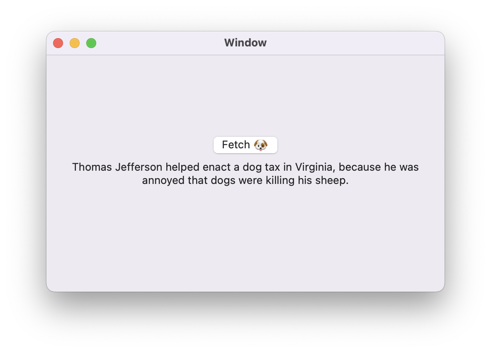

# Dog Facts App
A macOS app that shows random dog facts. 🤷🏻‍♂️ 

This project is kept as small and simple as possible to try out new concepts in Swift, such as [async/await](https://youtu.be/iGNxhCdRuSU), [SwiftUI](https://developer.apple.com/xcode/swiftui/), [Xcode Cloud](https://developer.apple.com/xcode-cloud/), etc.

### API

Thanks to the [Dog API](https://kinduff.github.io/dog-api/) (@[GitHub](https://github.com/kinduff/dog-api)) for providing a fun API to "fetch". 🐶

### Screenshot

### Roadmap
The eventual plan is to support all the Apple platforms - iPhone, iPad, Watch, TV.

I will start in AppKit on macOS, add iOS, and convert to SwiftUI as I add new platforms.

